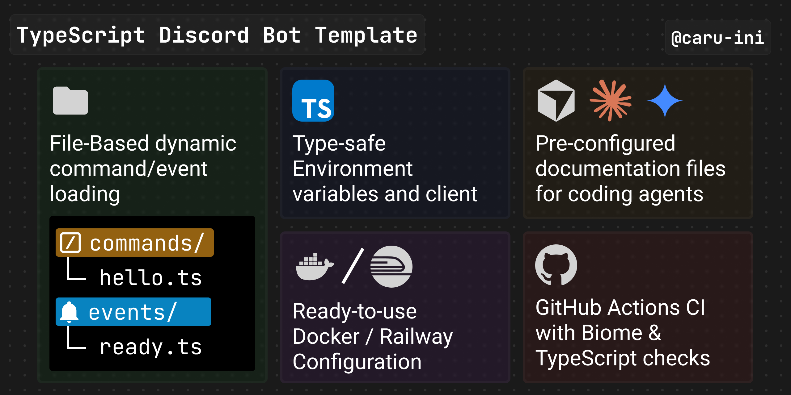

# Node.js + TypeScript Discord Bot Template



[](https://nodejs.org/)
[](https://www.typescriptlang.org/)
[](https://eslint.org/)
[](https://prettier.io/)
[](LICENSE)

A simple, type-safe Discord Bot template built with Node.js + ESLint + Prettier + TypeScript.

[](https://railway.com/deploy/discord-bot-template?referralCode=DIAbPh&utm_medium=integration&utm_source=template&utm_campaign=generic)

## Features

- Runs on Node.js 20+ with [tsx](https://github.com/privatenumber/tsx) for TypeScript execution
- Full type safety with Zod environment variable validation
- Dynamic command/event loading
- Docker/Railway deployment ready

## Quick Start

### Installation

```bash
npm install
```

### Configuration

```bash
cp .env.example .env
```

Edit `.env`:

```env
DISCORD_BOT_TOKEN=your_bot_token_here
DISCORD_APPLICATION_ID=your_application_id_here
DISCORD_GUILD_ID=your_guild_id_here  # optional
```

### Deploy Commands

```bash
npm run deploy-commands              # Guild deploy (development)
npm run deploy-commands -- --global  # Global deploy (production, take more time to propagate)
```

### Run

```bash
npm run start
```

## Project Structure

```
src/
├── index.ts          # Entry point
├── client.ts         # Discord client setup
├── env.ts            # Environment validation
├── types.d.ts        # Type definitions
├── deploy.ts         # Command deployment script
├── commands/         # Slash commands
│   ├── ping.ts
│   └── info.ts
├── events/           # Event handlers
│   ├── ready.ts
│   └── interaction-create.ts
└── utils/
    ├── core.ts       # Command/event loader
    └── logger.ts     # Logger configuration
```

## Adding Commands

Create a new file in `src/commands/`:

```typescript
import { type ChatInputCommandInteraction, SlashCommandBuilder } from 'discord.js';
import type { Command } from '@/types';

export const command: Command<ChatInputCommandInteraction> = {
  data: new SlashCommandBuilder().setName('hello').setDescription('Says hello!'),
  execute: async (interaction) => {
    await interaction.reply('Hello, World!');
  }
};
```

## Adding Events

Create a new file in `src/events/`:

```typescript
import { Events } from 'discord.js';
import type { Event } from '@/types';

export const event: Event<Events.GuildMemberAdd> = {
  name: Events.GuildMemberAdd,
  execute: async (member) => {
    console.log(`${member.user.tag} joined the server!`);
  }
};
```

## Deployment

### Railway

To deploy on Railway, simply connect the repository and set environment variables.

1. Create a project on [Railway](https://railway.app/)
2. Connect your GitHub repository
3. Set environment variables:
   - `DISCORD_BOT_TOKEN`
   - `DISCORD_APPLICATION_ID`
4. Automatic deployment

Or deploy via CLI:

```bash
railway up
```

### Docker

```bash
docker build -t discord-bot .
docker run -d --env-file .env discord-bot
```

## Scripts

| Command                   | Description                         |
| ------------------------- | ----------------------------------- |
| `npm run start`           | Start the bot                       |
| `npm run deploy-commands` | Deploy slash commands               |
| `npm run lint`            | Run ESLint                          |
| `npm run lint:fix`        | Run ESLint with auto-fix            |
| `npm run fmt`             | Format with Prettier                |
| `npm run check`           | ESLint + Prettier check (no writes) |
| `npm run typecheck`       | TypeScript type check               |

## Contributing

Contributions are very welcome!

### Bug Reports & Feature Requests

Please use [GitHub Issues](https://github.com/caru-ini/discord-bot-template/issues) to report bugs or suggest features.

### Pull Requests

1. Fork the repository
2. Create a feature branch (`git checkout -b feature/amazing-feature`)
3. Make your changes
4. Run checks:
   ```bash
   npm run check      # lint + format
   npm run typecheck  # type check
   ```
5. Commit with [Conventional Commits](https://www.conventionalcommits.org/):
   ```bash
   git commit -m "feat: add amazing feature"
   ```
6. Push and open a Pull Request

### Development Setup

```bash
npm install
cp .env.example .env
# Edit .env with your bot credentials
npm run start
```

## License

[MIT](LICENSE)
